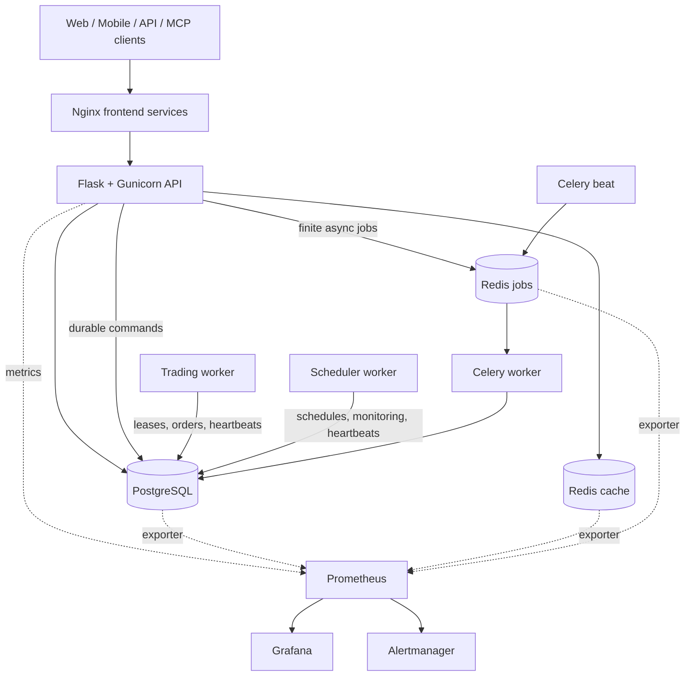

<div align="center">
  <a href="https://github.com/brokermr810/QuantDinger">
    
  </a>

  <h1>QuantDinger</h1>
  <p><strong>Self-hosted AI-assisted research, backtesting, and trading automation.</strong></p>
  <p>Research ideas, write Python strategies, validate them, and operate paper or live workflows from one stack.</p>

  <p>
    <a href="README.md"><strong>English</strong></a>
    ·
    <a href="docs/README_CN.md"><strong>简体中文</strong></a>
    ·
    <a href="docs/api/README.md"><strong>API</strong></a>
    ·
    <a href="docs/agent/README.md"><strong>AI Agents & MCP</strong></a>
  </p>

  <p>
    <a href="LICENSE"></a>
    
    
    
    
    
  </p>
</div>

> QuantDinger can submit real orders when live trading is explicitly enabled.
> Start with paper trading, use restricted API keys, and review the risk and
> compliance requirements for your jurisdiction. This project does not provide
> investment advice.

## What QuantDinger is

QuantDinger is a local-first trading platform for independent traders, Python
strategy authors, and small teams that want to keep their data and broker
credentials under their own control.

The project combines:

- multi-provider AI market research and analysis;
- Python indicators and `ScriptStrategy` development;
- server-side backtesting and experiment workflows;
- paper and live execution across crypto exchanges and traditional brokers;
- web, mobile H5, human API, Agent Gateway, and MCP access;
- PostgreSQL-backed state, durable workers, audit logs, and optional monitoring.

It is not a black-box signal service. Strategy code, risk settings, credentials,
and deployment remain under the operator's control.

## What changed in v5

The v5 backend is organized around explicit runtime and operational boundaries:

- the HTTP API no longer owns long-running trading or scheduler loops;
- trading, scheduling, Celery jobs, and migrations run as separate processes;
- Celery handles finite, retryable work while long-lived strategy runtimes stay
  in the trading worker;
- cache Redis and durable job Redis use separate instances and eviction policies;
- high-risk API contracts are represented in OpenAPI and protected by tests;
- JSON logs, request IDs, Prometheus metrics, dashboards, and alert rules are
  available through an optional observability overlay;
- the production overlay runs backend processes as a non-root user with a
  read-only root filesystem, dropped capabilities, and resource limits;
- CI checks syntax, lint, tests, release gates, Compose files, dependencies,
  source security, secrets, API compatibility, version drift, and text encoding.

The source version is declared in [`VERSION`](VERSION). Git release tags use the
same semantic version with a leading `v`, for example `v5.0.1`.

## Architecture



One backend image is reused by several containers with different commands:

| Process | Responsibility |
| --- | --- |
| `migration` | Applies the database schema and exits before application services start. |
| `backend` | Handles HTTP, authentication, validation, and durable command submission. |
| `trading-worker` | Owns strategy runtimes, pending orders, broker sessions, and reconciliation. |
| `scheduler-worker` | Runs portfolio, deployment, payment, and signal schedules. |
| `celery-worker` | Executes finite AI, backtest, experiment, report, and maintenance jobs. |
| `celery-beat` | Dispatches periodic Celery tasks. |

See [Backend process roles](docs/architecture/PROCESS_ROLES_AND_TASKS.md),
[architecture](docs/architecture/ARCHITECTURE.md), and
[concurrency model](docs/architecture/CONCURRENCY_MODEL.md) for the ownership rules.

## Quick start

### Option A: prebuilt images

Prerequisites: Docker with Compose v2. Node.js and a local Python environment are
not required.

Linux or macOS:

```bash
curl -fsSL https://raw.githubusercontent.com/brokermr810/QuantDinger/main/install.sh | bash
```

Windows PowerShell:

```powershell
irm https://raw.githubusercontent.com/brokermr810/QuantDinger/main/install.ps1 | iex
```

The installer asks for the initial administrator credentials, generates the
required secrets, downloads the GHCR Compose stack, and starts it.

Open:

- Web: <http://127.0.0.1:8888>
- Mobile H5: <http://127.0.0.1:8889>
- API health: <http://127.0.0.1:5000/api/health>

### Option B: source checkout

```bash
git clone https://github.com/brokermr810/QuantDinger.git
cd QuantDinger
cp backend_api_python/env.example backend_api_python/.env
cp .env.example .env
```

Before the first start, replace the example values in both environment files:

| File | Required production values |
| --- | --- |
| `backend_api_python/.env` | `SECRET_KEY`, `CREDENTIAL_ENCRYPTION_KEY`, `ADMIN_USER`, `ADMIN_PASSWORD` |
| `.env` | `POSTGRES_PASSWORD`, `REDIS_PASSWORD`, `CELERY_REDIS_PASSWORD`, `GRAFANA_ADMIN_PASSWORD` |

Generate independent secrets with:

```bash
python -c "import secrets; print(secrets.token_hex(32))"
```

Start the core stack from local backend source:

```bash
docker compose up -d --build
docker compose ps
```

The base stack does not start Prometheus, Grafana, or Alertmanager. This keeps
the default open-source installation smaller.

For detailed installation paths, Windows notes, China mirror settings, and
PostgreSQL migration guidance, see
[Installation troubleshooting](docs/deployment/INSTALL_TROUBLESHOOTING.md) and the
[cloud deployment guide](docs/deployment/CLOUD_DEPLOYMENT_EN.md).

## Production deployment

Validate secrets before starting a production stack:

```bash
python backend_api_python/scripts/check_production_config.py \
  --env-file .env \
  --env-file backend_api_python/.env
```

Start the hardened runtime with optional observability:

```bash
docker compose \
  -f docker-compose.yml \
  -f docker-compose.production.yml \
  -f docker-compose.observability.yml \
  up -d --build
```

Omit `docker-compose.observability.yml` when the host is resource-constrained or
monitoring is provided externally.

Production rules:

- expose only a TLS reverse proxy on ports 80/443;
- keep PostgreSQL, both Redis instances, Prometheus, Grafana, and Alertmanager
  off the public internet;
- do not deploy with example passwords or empty encryption keys;
- back up PostgreSQL and the durable `redis-jobs` volume;
- keep cache Redis disposable and never use it as the Celery broker;
- review worker health and application readiness after every deployment.

The full checklist is in [Production hardening](docs/deployment/PRODUCTION_HARDENING.md).

## Local endpoints

All published ports bind to loopback by default.

| Service | Default URL | Purpose |
| --- | --- | --- |
| Web | <http://127.0.0.1:8888> | Desktop web client and same-origin API proxy. |
| Mobile H5 | <http://127.0.0.1:8889> | Mobile web client and same-origin API proxy. |
| Backend | <http://127.0.0.1:5000> | Direct API access and health endpoints. |
| Grafana | <http://127.0.0.1:3000> | Dashboards; available only with the observability overlay. |
| Prometheus | <http://127.0.0.1:9090> | Metrics storage and queries; optional. |
| Alertmanager | <http://127.0.0.1:9093> | Alert grouping, silencing, and delivery; optional. |

Container-only ports such as the job Redis and exporters are not published to
the host.

## Observability

The monitoring stack is optional by design:

- **Prometheus** collects API, worker, PostgreSQL, and Redis metrics.
- **Grafana** turns those metrics into operator dashboards.
- **Alertmanager** groups alerts, manages silences, and sends notifications once
  a receiver is configured.

Start it for local diagnostics without the production overlay:

```bash
docker compose \
  -f docker-compose.yml \
  -f docker-compose.observability.yml \
  up -d
```

Monitoring services stay on `127.0.0.1`. Use a VPN, SSH tunnel, or authenticated
reverse proxy for remote administration. See
[Observability](docs/deployment/OBSERVABILITY.md) for dashboards, alerts, retention, and
receiver configuration.

## Security model

- Broker credentials and MFA secrets are encrypted with a stable
  `CREDENTIAL_ENCRYPTION_KEY`.
- Agent tokens are hashed, scoped, rate-limited, and audit-logged.
- Agent trading is paper-only by default; live access requires both token and
  server-side authorization.
- Long-running strategy ownership uses leases, heartbeats, and fencing tokens.
- Production containers run without root privileges or Linux capabilities.
- Host port defaults are loopback-only; public access should terminate at a TLS
  reverse proxy.

Report vulnerabilities privately according to [SECURITY.md](SECURITY.md). Do
not include credentials, account data, or exploitable details in public issues.

## Strategy and integration surfaces

| Area | Current surface |
| --- | --- |
| Indicators | Python chart overlays, markers, bands, and signals. |
| Strategies | `ScriptStrategy` intents, sizing, risk, backtests, and live runtime. |
| Crypto | Binance, OKX, Bitget, Bybit, Gate, HTX, Coinbase Exchange, Kraken, and adapter extensions. |
| Traditional brokers | IBKR and Alpaca workflows. |
| AI providers | OpenRouter, OpenAI-compatible APIs, Google, DeepSeek, Grok, MiniMax, and custom endpoints. |
| Automation | Human API, Agent Gateway, MCP server, Celery jobs, schedules, and notifications. |

Start with the [Indicator guide](docs/trading/INDICATOR_DEV_GUIDE.md),
[Strategy guide](docs/trading/STRATEGY_DEV_GUIDE.md), and
[Extension guide](docs/architecture/EXTENSION_GUIDE.md).

## AI agents and MCP

The Agent Gateway is exposed under `/api/agent/v1`. The included MCP server lets
clients such as Cursor, Claude Code, and Codex call approved tools without
receiving broker credentials or administrator JWTs.

Live trading through an agent requires all of the following:

1. a token with trading scope;
2. `paper_only=false` on that token;
3. `AGENT_LIVE_TRADING_ENABLED=true` on the server;
4. operator-configured limits and allowlists.

See [MCP setup](docs/agent/MCP_SETUP.md),
[Agent quick start](docs/agent/AGENT_QUICKSTART.md), and the
[Agent OpenAPI document](docs/agent/agent-openapi.json).

## Development

Backend development uses Python 3.12:

```bash
cd backend_api_python
python -m venv .venv
python -m pip install -r requirements-dev.txt
python -m pytest -m "not integration and not stress" --ignore=tests/release_gate -q
ruff check app scripts tests
```

Useful repository checks:

```bash
python scripts/check_version.py
python scripts/check_mojibake.py
docker compose -f docker-compose.yml config -q
docker compose -f docker-compose.yml -f docker-compose.production.yml -f docker-compose.observability.yml config -q
```

API changes should follow [API conventions](docs/architecture/API_CONVENTIONS.md), update the
OpenAPI artifact when required, and pass the compatibility workflow.

## Repository layout

```text
backend_api_python/              Flask API, domain services, workers, migrations, tests
docs/                            Architecture, operations, API, strategy, and integration guides
mcp_server/                      QuantDinger MCP server
ops/                             Prometheus, Grafana, and Alertmanager configuration
scripts/                         Version, encoding, and setup utilities
docker-compose.yml               Core local/source stack
docker-compose.ghcr.yml          Prebuilt-image stack
docker-compose.production.yml    Runtime hardening overlay
docker-compose.observability.yml Optional monitoring overlay
```

The web and mobile source repositories publish their own GHCR images. Node.js is
only needed when building those clients from source.

## Documentation

The maintained documentation index is available at [`docs/README.md`](docs/README.md).

| Topic | Document |
| --- | --- |
| Contributor architecture | [Architecture](docs/architecture/ARCHITECTURE.md) |
| Module ownership | [Module boundaries](docs/architecture/MODULE_BOUNDARIES.md) |
| Process and task ownership | [Process roles](docs/architecture/PROCESS_ROLES_AND_TASKS.md) |
| Production runtime | [Production hardening](docs/deployment/PRODUCTION_HARDENING.md) |
| Metrics and alerts | [Observability](docs/deployment/OBSERVABILITY.md) |
| Human API contracts | [API conventions](docs/architecture/API_CONVENTIONS.md) |
| OpenAPI artifacts | [API documentation](docs/api/README.md) |
| Strategy development | [Strategy guide](docs/trading/STRATEGY_DEV_GUIDE.md) |
| Indicator development | [Indicator guide](docs/trading/INDICATOR_DEV_GUIDE.md) |
| MCP and agents | [Agent documentation](docs/agent/README.md) |
| Cloud deployment | [Cloud deployment](docs/deployment/CLOUD_DEPLOYMENT_EN.md) |
| Installation problems | [Troubleshooting](docs/deployment/INSTALL_TROUBLESHOOTING.md) |

## Contributing

Read [CONTRIBUTING.md](CONTRIBUTING.md) and [DEVELOPMENT.md](DEVELOPMENT.md)
before opening a pull request. Keep routes thin, preserve API compatibility,
place long-running behavior in the correct process, and include focused tests
for high-risk changes.

## License and community

The repository is licensed under [Apache License 2.0](LICENSE). The QuantDinger
name and marks are covered separately by [TRADEMARKS.md](TRADEMARKS.md).

- Issues: <https://github.com/brokermr810/QuantDinger/issues>
- Telegram: <https://t.me/quantdinger>
- Discord: <https://discord.com/invite/tyx5B6TChr>
- Website: <https://www.quantdinger.com>
