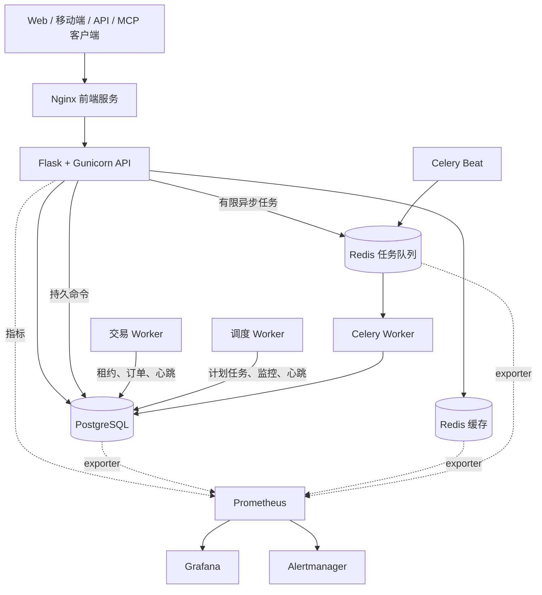

<div align="center">
  <a href="https://github.com/brokermr810/QuantDinger">
    
  </a>

  <h1>QuantDinger</h1>
  <p><strong>可自托管的 AI 辅助研究、回测与交易自动化平台。</strong></p>
  <p>在一套由自己掌控的系统中完成研究、Python 策略开发、验证、模拟盘和实盘运行。</p>

  <p>
    <a href="../README.md"><strong>English</strong></a>
    ·
    <a href="README_CN.md"><strong>简体中文</strong></a>
    ·
    <a href="api/README.md"><strong>API</strong></a>
    ·
    <a href="agent/README.md"><strong>AI Agent 与 MCP</strong></a>
  </p>

  <p>
    <a href="../LICENSE"></a>
    
    
    
    
    
  </p>
</div>

> QuantDinger 在明确启用实盘交易后可以提交真实订单。请先使用模拟盘，
> 为交易 API 设置最小权限，并自行确认所在地区的风险和合规要求。
> 本项目不提供投资建议。

## QuantDinger 是什么

QuantDinger 面向独立交易者、Python 策略开发者和小型团队。它采用本地优先、
可自托管的方式，让行情数据、策略代码、交易凭据和部署环境由使用者自己掌控。

项目提供：

- 多 AI 提供商的市场研究和分析；
- Python 指标和 `ScriptStrategy` 策略开发；
- 服务端回测与实验工作流；
- 加密货币交易所和传统券商的模拟盘、实盘执行；
- Web、移动 H5、Human API、Agent Gateway 和 MCP 接入；
- PostgreSQL 状态存储、持久任务、审计日志和可选监控。

它不是黑盒信号服务。策略代码、风控参数、账户凭据和运行环境都由运营者管理。

## v5 的主要变化

v5 后端按照清晰的进程职责和运维边界重新组织：

- HTTP API 不再承载长期运行的交易循环和调度线程；
- API、交易、调度、Celery、定时投递和数据库迁移使用独立进程；
- Celery 只处理有限、可序列化、可重试的任务，长期策略仍归交易进程管理；
- 普通缓存 Redis 与持久任务 Redis 完全分离，使用不同淘汰策略；
- 高风险 API 契约进入 OpenAPI 和自动化测试；
- 可通过独立覆盖层启用 JSON 日志、请求 ID、Prometheus 指标、仪表盘和告警；
- 生产覆盖层启用非 root 用户、只读根文件系统、能力移除和资源限制；
- CI 检查语法、规范、测试、发布门禁、Compose、依赖安全、密钥、API 兼容性、版本和文本编码。

源码版本记录在 [`VERSION`](../VERSION) 中。Git 发布标签在同一语义版本前增加
`v`，例如 `v5.0.1`。

## 系统架构



同一个后端镜像由多个容器使用，每个容器执行不同命令：

| 进程 | 职责 |
| --- | --- |
| `migration` | 启动前应用数据库结构，成功后退出。 |
| `backend` | 处理 HTTP、认证、校验和持久命令提交。 |
| `trading-worker` | 管理策略运行、待处理订单、券商会话和状态对账。 |
| `scheduler-worker` | 执行组合、部署、支付和信号相关的计划任务。 |
| `celery-worker` | 执行有限的 AI、回测、实验、报告和维护任务。 |
| `celery-beat` | 定期向 Celery 投递任务。 |

详细规则见[后端进程职责](architecture/PROCESS_ROLES_AND_TASKS.md)、
[架构说明](architecture/ARCHITECTURE.md)和[并发模型](architecture/CONCURRENCY_MODEL.md)。

## 快速启动

### 方案 A：使用预构建镜像

前置条件：Docker 和 Compose v2。不需要本地安装 Node.js 或 Python 开发环境。

Linux 或 macOS：

```bash
curl -fsSL https://raw.githubusercontent.com/brokermr810/QuantDinger/main/install.sh | bash
```

Windows PowerShell：

```powershell
irm https://raw.githubusercontent.com/brokermr810/QuantDinger/main/install.ps1 | iex
```

安装程序会要求设置初始管理员，生成必要密钥，下载 GHCR Compose 配置并启动服务。

启动后访问：

- PC Web：<http://127.0.0.1:8888>
- 移动 H5：<http://127.0.0.1:8889>
- API 健康检查：<http://127.0.0.1:5000/api/health>

### 方案 B：从源码启动

```bash
git clone https://github.com/brokermr810/QuantDinger.git
cd QuantDinger
cp backend_api_python/env.example backend_api_python/.env
cp .env.example .env
```

首次启动前，必须替换两个环境文件里的示例值：

| 文件 | 生产环境必须设置的变量 |
| --- | --- |
| `backend_api_python/.env` | `SECRET_KEY`、`CREDENTIAL_ENCRYPTION_KEY`、`ADMIN_USER`、`ADMIN_PASSWORD` |
| `.env` | `POSTGRES_PASSWORD`、`REDIS_PASSWORD`、`CELERY_REDIS_PASSWORD`、`GRAFANA_ADMIN_PASSWORD` |

每个密钥应独立生成：

```bash
python -c "import secrets; print(secrets.token_hex(32))"
```

从本地后端源码启动核心服务：

```bash
docker compose up -d --build
docker compose ps
```

基础服务不会启动 Prometheus、Grafana 和 Alertmanager，从而避免普通开源安装
默认承担完整监控栈的资源开销。

Windows、国内镜像、数据库迁移等问题见
[安装故障排查](deployment/INSTALL_TROUBLESHOOTING.md)和[云部署指南](deployment/CLOUD_DEPLOYMENT_CN.md)。

## 生产部署

启动前校验全部生产密钥：

```bash
python backend_api_python/scripts/check_production_config.py \
  --env-file .env \
  --env-file backend_api_python/.env
```

启用生产加固和可选监控：

```bash
docker compose \
  -f docker-compose.yml \
  -f docker-compose.production.yml \
  -f docker-compose.observability.yml \
  up -d --build
```

资源有限或已经接入外部监控时，可以去掉 `docker-compose.observability.yml`。

生产规则：

- 只通过 TLS 反向代理对外开放 80/443；
- PostgreSQL、两套 Redis、Prometheus、Grafana、Alertmanager 不直接暴露公网；
- 不使用示例密码，不允许核心加密密钥为空；
- 备份 PostgreSQL 和持久化的 `redis-jobs` 数据卷；
- 缓存 Redis 可以淘汰数据，但不能作为 Celery broker；
- 每次部署后检查 API 就绪状态和 Worker 心跳。

完整清单见[生产加固](deployment/PRODUCTION_HARDENING.md)。

## 本机服务地址

所有宿主机端口默认只绑定 `127.0.0.1`。

| 服务 | 默认地址 | 用途 |
| --- | --- | --- |
| PC Web | <http://127.0.0.1:8888> | PC 客户端和同源 API 代理。 |
| 移动 H5 | <http://127.0.0.1:8889> | 移动客户端和同源 API 代理。 |
| 后端 API | <http://127.0.0.1:5000> | API 与健康检查。 |
| Grafana | <http://127.0.0.1:3000> | 监控仪表盘，需要可观测性覆盖层。 |
| Prometheus | <http://127.0.0.1:9090> | 指标采集、存储和查询，可选。 |
| Alertmanager | <http://127.0.0.1:9093> | 告警分组、静默和通知，可选。 |

任务 Redis 和 exporter 等仅开放容器内部端口，不映射到宿主机。

## 可观测性

监控栈默认可选：

- **Prometheus** 采集 API、Worker、PostgreSQL 和 Redis 指标；
- **Grafana** 把指标展示为运维仪表盘；
- **Alertmanager** 对告警分组、去重、静默，并在配置接收器后发送通知。

本地诊断时可以不启用生产覆盖层：

```bash
docker compose \
  -f docker-compose.yml \
  -f docker-compose.observability.yml \
  up -d
```

监控端口仍只绑定本机。远程管理应使用 VPN、SSH 隧道或带认证的反向代理。
仪表盘、规则、数据保留和通知配置见[可观测性说明](deployment/OBSERVABILITY.md)。

## 安全模型

- 券商凭据和 MFA 密钥使用稳定的 `CREDENTIAL_ENCRYPTION_KEY` 加密；
- Agent Token 经过哈希、权限范围、限流和审计控制；
- Agent 默认只能使用模拟盘，实盘需要 Token 和服务端同时授权；
- 长期策略所有权通过租约、心跳和 fencing token 管理；
- 生产容器使用非 root 用户并移除 Linux capabilities；
- 默认端口只监听本机，公网入口应由 TLS 反向代理统一承接。

安全问题请按照 [SECURITY.md](../SECURITY.md) 私下报告。不要在公开 Issue 中提供
凭据、账户信息或可以直接利用的漏洞细节。

## 策略与集成能力

| 领域 | 当前能力 |
| --- | --- |
| 指标 | Python 图表覆盖、标记、区间和信号。 |
| 策略 | `ScriptStrategy` 意图、仓位、风控、回测和实盘运行。 |
| 加密货币 | Binance、OKX、Bitget、Bybit、Gate、HTX、Coinbase Exchange、Kraken 及扩展适配器。 |
| 传统券商 | IBKR 和 Alpaca 工作流。 |
| AI 提供商 | OpenRouter、OpenAI 兼容接口、Google、DeepSeek、Grok、MiniMax 和自定义端点。 |
| 自动化 | Human API、Agent Gateway、MCP、Celery、计划任务和通知。 |

开发前建议阅读[指标开发指南](trading/INDICATOR_DEV_GUIDE_CN.md)、
[策略开发指南](trading/STRATEGY_DEV_GUIDE_CN.md)和[扩展指南](architecture/EXTENSION_GUIDE.md)。

## AI Agent 与 MCP

Agent Gateway 位于 `/api/agent/v1`。仓库内的 MCP Server 可以让 Cursor、
Claude Code、Codex 等客户端调用经过授权的工具，而不需要获得券商凭据或管理员 JWT。

Agent 实盘交易必须同时满足：

1. Token 包含交易权限；
2. Token 设置 `paper_only=false`；
3. 服务端设置 `AGENT_LIVE_TRADING_ENABLED=true`；
4. 运营者已经配置限额和白名单。

详细步骤见 [MCP 配置](agent/MCP_SETUP.md)、
[Agent 快速入门](agent/AGENT_QUICKSTART.md)和
[Agent OpenAPI](agent/agent-openapi.json)。

## 开发与验证

后端使用 Python 3.12：

```bash
cd backend_api_python
python -m venv .venv
python -m pip install -r requirements-dev.txt
python -m pytest -m "not integration and not stress" --ignore=tests/release_gate -q
ruff check app scripts tests
```

仓库级检查：

```bash
python scripts/check_version.py
python scripts/check_mojibake.py
docker compose -f docker-compose.yml config -q
docker compose -f docker-compose.yml -f docker-compose.production.yml -f docker-compose.observability.yml config -q
```

修改 API 时应遵守 [API 契约规范](architecture/API_CONVENTIONS.md)，按需重新生成 OpenAPI，
并通过兼容性检查。

## 仓库结构

```text
backend_api_python/              Flask API、领域服务、Worker、迁移与测试
docs/                            架构、运维、API、策略和集成文档
mcp_server/                      QuantDinger MCP Server
ops/                             Prometheus、Grafana、Alertmanager 配置
scripts/                         版本、编码和安装辅助工具
docker-compose.yml               本地源码核心服务
docker-compose.ghcr.yml          预构建镜像服务
docker-compose.production.yml    生产加固覆盖层
docker-compose.observability.yml 可选监控覆盖层
```

Web 和移动端源码仓库独立发布 GHCR 镜像。只有从源码构建客户端时才需要 Node.js。

## 文档导航

全部维护中文档见 [`docs/README.md`](README.md)。

| 主题 | 文档 |
| --- | --- |
| 贡献者架构 | [架构说明](architecture/ARCHITECTURE.md) |
| 模块职责 | [模块边界](architecture/MODULE_BOUNDARIES.md) |
| 进程与任务职责 | [进程职责](architecture/PROCESS_ROLES_AND_TASKS.md) |
| 生产运行 | [生产加固](deployment/PRODUCTION_HARDENING.md) |
| 指标与告警 | [可观测性](deployment/OBSERVABILITY.md) |
| Human API 契约 | [API 规范](architecture/API_CONVENTIONS.md) |
| OpenAPI | [API 文档](api/README.md) |
| 策略开发 | [策略指南](trading/STRATEGY_DEV_GUIDE_CN.md) |
| 指标开发 | [指标指南](trading/INDICATOR_DEV_GUIDE_CN.md) |
| MCP 与 Agent | [Agent 文档](agent/README.md) |
| 云部署 | [云部署指南](deployment/CLOUD_DEPLOYMENT_CN.md) |
| 安装问题 | [故障排查](deployment/INSTALL_TROUBLESHOOTING.md) |

## 参与贡献

提交 Pull Request 前请阅读 [CONTRIBUTING.md](../CONTRIBUTING.md) 和
[DEVELOPMENT.md](../DEVELOPMENT.md)。保持路由轻量，维护 API 兼容性，把长期任务放到
正确的进程，并为高风险修改补充针对性测试。

## 许可与社区

本仓库采用 [Apache License 2.0](../LICENSE)。QuantDinger 名称和标识另受
[TRADEMARKS.md](../TRADEMARKS.md) 约束。

- Issues：<https://github.com/brokermr810/QuantDinger/issues>
- Telegram：<https://t.me/quantdinger>
- Discord：<https://discord.com/invite/tyx5B6TChr>
- 官网：<https://www.quantdinger.com>
